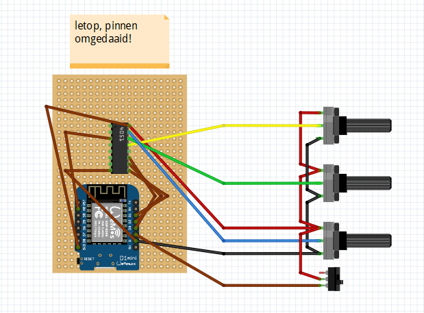
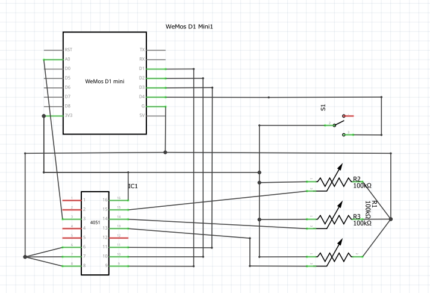

# WEMOS-Hue-RGB-Controller

Copy config.example.h to config.h and fil in own wifi and api settings

Note: in schematic:
- switch is connected to 3.3 volts, change to ground instead.
- switch connects on D6 instead of D4, solving issues on boot.

